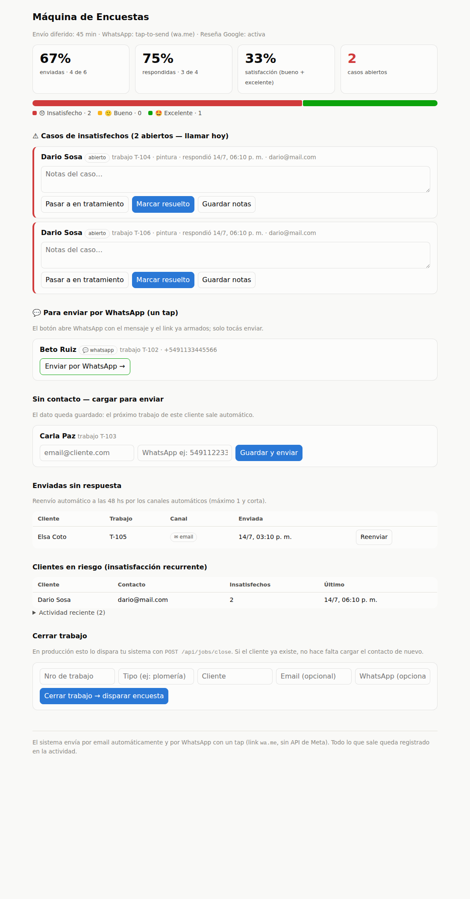

# Máquina de Encuestas

Encuestas de satisfacción post-trabajo para un negocio de servicios: el cierre
del trabajo dispara automáticamente una encuesta de **una sola pregunta** al
cliente (por email o WhatsApp), y el dueño gestiona todo desde un tablero:
métricas, casos de insatisfechos con seguimiento, y reenvíos con límite.

Diseñado a partir de [`docs/user-journey.md`](docs/user-journey.md) y evolucionado
con lo adoptado en [`docs/comparacion-flujo-berlim.md`](docs/comparacion-flujo-berlim.md).



## Cómo correr

**Cero dependencias**: solo Node.js ≥ 22 (usa `node:http` y `node:sqlite`; el
frontend es una SPA estática sin build).

```bash
node server.js        # tablero en http://localhost:3000
npm run seed          # poblar encuestas de prueba (o DEMO_SEED=1 al arrancar)
node --test test.js   # tests end-to-end (flujos + scheduler + auth + seed)
```

## Deploy en Vercel + Supabase (URL pública)

El sistema corre en dos modos: **proceso persistente** (local/VPS, SQLite,
cero config) o **serverless** (Vercel) con el estado en Postgres (Supabase).
`store.js` elige el backend según las variables de entorno.

1. En [vercel.com](https://vercel.com): **Add New → Project** → importar
   este repo. Framework preset: **Other** (no hay build).
2. Variables de entorno del proyecto:

   | Variable | Valor |
   |---|---|
   | `SUPABASE_URL` | la URL del proyecto de Supabase |
   | `SUPABASE_SERVICE_ROLE_KEY` | la service key (Supabase → Settings → API Keys). Solo vive en el server |
   | `ADMIN_PASS` | clave del tablero (usuario `admin`) |
   | `DEMO_SEED` | `1` para poblar encuestas de prueba la primera vez |
   | `CRON_SECRET` | un secreto cualquiera; autentica `/api/cron` |
   | `GOOGLE_REVIEW_URL` | opcional: link de reseñas de Google |

3. Deploy. Verificar con `https://<tu-app>.vercel.app/api/selftest`
   (pide la clave del tablero): tiene que responder `ok: true` y
   `backend: "supabase"`.

La base la crea la migración de `docs/` (tablas `enc_*` con RLS, aisladas
dentro del proyecto de Supabase). Los datos **persisten** — el seed corre
una sola vez.

**El scheduler en serverless**: no hay proceso residente, así que los
trabajos de tiempo (envío diferido, reenvío 48hs, seguimiento semanal)
corren de forma perezosa con cada visita al tablero (máx. 1 vez/min) y
vía `GET /api/cron` (Vercel cron diario incluido en `vercel.json`; para
más frecuencia, un ping externo gratuito tipo cron-job.org cada 15 min
con `?secret=CRON_SECRET`). Para una demo, con tener el tablero abierto
alcanza.

**Alternativas**: `node server.js` en cualquier VPS o Railway/Fly
(SQLite o Supabase, scheduler interno real), `render.yaml` para Render,
`Dockerfile` para todo lo demás.

## Canales de envío — automatizar sin depender de Meta

El requisito: automatizar envío y recolección **sin** atarse a la API de
WhatsApp Business (aprobación de Meta, complejidad de integración). El sistema
resuelve el envío por canal según el contacto disponible:

| Canal | Cómo funciona | Automatización |
|---|---|---|
| **Email** (default si hay email) | El mensaje sale a `SEND_WEBHOOK_URL` (Resend, SES, Zapier, n8n…) | 100% automática |
| **WhatsApp tap-to-send** (si solo hay teléfono) | El sistema arma un link `wa.me` con el mensaje y el link a la encuesta ya escritos; el operario lo toca en el tablero y sale desde su propio WhatsApp | Un tap — sin API de Meta, sin aprobación |
| **WhatsApp gateway** (opcional) | Si configurás `WHATSAPP_WEBHOOK_URL` (Twilio, un BSP, n8n), el envío pasa a ser 100% automático | 100% automática |

La **recolección** es siempre automática: el cliente responde en una página
pública de un tap (sin login) y la respuesta impacta en el tablero al instante.
Todo lo que sale queda registrado en la tabla `outbox` (auditable en la
sección "Actividad" del tablero).

## El flujo completo

1. **Cierre del trabajo** → `POST /api/jobs/close` (idempotente por `ref`).
   Si el cliente ya tiene contacto guardado, no hay que cargar nada.
2. **Envío diferido** → la encuesta se programa a los `SEND_DELAY_MINUTES`
   (default 45) para que llegue cuando el cliente ya vivió el resultado.
3. **Envío** → automático (email/gateway) o tap-to-send (WhatsApp sin gateway).
   Sin contacto: queda visible en el tablero; al cargarlo una vez, **queda en
   memoria** para el próximo trabajo de ese cliente.
4. **Respuesta** → 1 pregunta, 3 botones (😞 🙂 🤩), sin login, idempotente.
   - **Excelente** → CTA de reseña pública en Google (`GOOGLE_REVIEW_URL`).
   - **Insatisfecho** → alerta inmediata al dueño + **caso** abierto.
5. **Casos** → `abierto → en_tratamiento → resuelto`, con notas, seguimiento
   automático semanal al dueño mientras siga abierto, y agradecimiento al
   cliente al resolver (con foco en la resolución).
6. **Seguimiento de no respondidas** → reenvío automático a las
   `AUTO_REMINDER_HOURS` (default 48) por canales automáticos, **máximo 1 y
   corta** (regla anti-spam aplicada en el servidor, no solo en la UI).

## Vistas (modelo CRM)

Cada encuesta es un registro con ID citable (`ENC-0042`) y el cliente es la
entidad central. Las vistas están separadas por tarea (ver el análisis en
[`docs/journey-operario-crm.md`](docs/journey-operario-crm.md)):

| Vista | Tarea | Contenido |
|---|---|---|
| **Operación** | hacer | KPIs, casos abiertos, colas de acción (WhatsApp, contactos, reenvíos) |
| **Encuestas** | buscar | Registro completo filtrable (estado × tipo × búsqueda) + export CSV |
| **Clientes** | contexto | Agregados por cliente y ficha con timeline (trabajos, envíos, respuestas, casos) |
| **Resultados** | decidir | General (empresa) · por tipo de servicio · por cliente |

### Roles

Dos credenciales sobre el mismo Basic Auth, aplicadas **en el servidor**:

| Rol | Credencial | Ve | Hace |
|---|---|---|---|
| **Operador** | `OPERATOR_USER`/`OPERATOR_PASS` | Solo **Operación** | Cierra trabajos (dispara encuestas), envía WhatsApp, carga contactos, reenvía, trabaja casos |
| **Gerente** | `ADMIN_USER`/`ADMIN_PASS` | Todo: Operación + **Encuestas** (registro completo) + **Clientes** + **Resultados** globales | Todo lo anterior + análisis y export |

El operador recibe `403` en `/api/crm` y `/api/selftest` — la restricción no
es solo esconder pestañas. El rol viene en `config.role` de `/api/state`.

**Entrada**: la landing en `/` explica el sistema y tiene la caja de login;
al ingresar se crea una sesión de 7 días por cookie firmada (HMAC, sin
dependencias) y se pasa al tablero en `/app`. La API también acepta Basic
Auth directo (integraciones y scripts). `SESSION_SECRET` es opcional: sin
ella, la firma se deriva de las claves (rotar una clave invalida las
sesiones).


## Configuración (env, todo opcional)

| Variable | Default | Para qué |
|---|---|---|
| `PORT` / `BASE_URL` | `3000` / `http://localhost:PORT` | URL pública (va en los links de encuesta) |
| `DB_PATH` | `encuestas.db` | Archivo SQLite |
| `SEND_DELAY_MINUTES` | `45` | Envío diferido post-cierre (0 = inmediato) |
| `AUTO_REMINDER_HOURS` | `48` | Reenvío automático si no respondió (0 = off) |
| `CASE_FOLLOWUP_DAYS` | `7` | Frecuencia del seguimiento de casos abiertos |
| `GOOGLE_REVIEW_URL` | — | Link de reseña que ve quien responde "excelente" |
| `SEND_WEBHOOK_URL` | — | Transporte de email (sin esto, queda solo en outbox — modo dev) |
| `WHATSAPP_WEBHOOK_URL` | — | Gateway de WhatsApp (sin esto, modo tap-to-send) |
| `ALERT_WEBHOOK_URL` | `SEND_WEBHOOK_URL` | Alertas y seguimientos al dueño |
| `OWNER_CONTACT` | — | Destinatario de alertas/seguimientos |
| `ADMIN_USER` / `ADMIN_PASS` | `admin` / — | Basic Auth del tablero y la API (sin `ADMIN_PASS` queda abierto: solo dev). Las encuestas del cliente (`/s/:token`) son siempre públicas |
| `DEMO_SEED` | — | Con `1`, puebla datos de prueba al arrancar con base vacía |
| `SUPABASE_URL` / `SUPABASE_SERVICE_ROLE_KEY` | — | Con ambas, el estado vive en Postgres (Supabase) en vez de SQLite |
| `CRON_SECRET` | — | Autentica `GET /api/cron` (tick del scheduler desde afuera) |

El payload de todos los webhooks es
`{kind, channel, recipient, subject, body}` — un `if` en Zapier/n8n alcanza
para rutearlo a cualquier proveedor.

## API

| Método y ruta | Qué hace |
|---|---|
| `POST /api/jobs/close` | Hook de cierre: `{ref, type?, client_name, client_email?, client_phone?}` |
| `GET /api/state` | Todo el estado de la vista Operación en un call |
| `GET /api/crm` | Registro de encuestas + agregados por cliente y por tipo (vistas CRM) |
| `GET /api/metrics` | Solo los números |
| `POST /api/surveys/:id/contact` | Carga contacto faltante (`{email?, phone?}`) y envía |
| `POST /api/surveys/:id/resend` | Reenvío manual por canal automático (máx. 1) |
| `GET /wa/:id` | Tap-to-send: marca enviada/reenviada y redirige a `wa.me` |
| `POST /api/cases/:id` | Estado y notas del caso (`{status?, notes?}`) |
| `GET /s/:token` · `POST /s/:token` | Encuesta pública (1 tap, sin login) |

## Estructura

```
handler.js         rutas + flujo core + páginas públicas (agnóstico de runtime y datos)
store.js           elige backend: SQLite (default) o Supabase (serverless)
store-sqlite.js    node:sqlite — local, VPS, tests
store-supabase.js  Postgres vía PostgREST con fetch (sin SDK)
scheduler.js       envío diferido, reenvío 48hs, seguimiento de casos
notify.js          outbox + webhooks + links wa.me + textos de mensajes
seed.js            datos de demo (npm run seed / DEMO_SEED=1)
server.js          runner local/VPS (proceso persistente + scheduler)
api/index.js       entry point serverless (Vercel)
ui/                tablero (SPA vanilla, sin build)
test.js            tests end-to-end contra el server real
docs/              journeys, comparación BERLIM, planes, capturas
```

## Qué queda para después

- **Múltiples encuestas por tipo de servicio** (etapa 2 del journey): tabla de
  plantillas + mapeo desde `jobs.type`; el campo ya se guarda.
- **NPS 0-10**: migrable cuando haya tasa de respuesta medida — el desglose
  actual mapea a detractor/pasivo/promotor.
- **Autenticación del tablero**: hoy no tiene (correr detrás de una VPN o
  reverse proxy con auth hasta agregarla).
